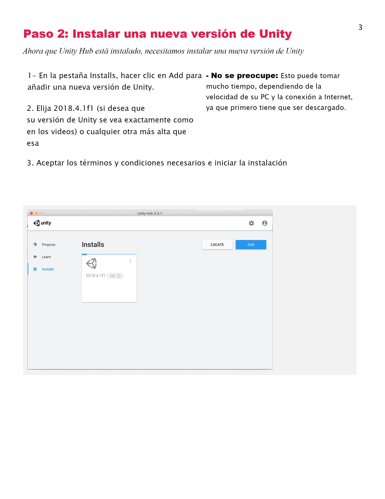

#### Create with Code

Software para la creaciòn de modelos 3D.

[Create with Code](https://ephtracy.github.io)

<iframe title="PDF in an i-Frame" src="pdfs/Plan de estudio.pdf" frameborder="1" scrolling="auto" height="1100" width="850" ></iframe>

### Lección 1

{:width="600px"}
{:width="600px"}
{:width="600px"}
{:width="600px"}

### Lección 2

{:width="600px"}
{:width="600px"}
{:width="600px"}
{:width="600px"}
{:width="600px"}

### Plan de estudio del curso

{:width="600px"}
{:width="600px"}
{:width="600px"}
{:width="600px"}

### Hoja de trabajo

{:width="600px"}
{:width="600px"}
{:width="600px"}
{:width="600px"}
{:width="600px"}
